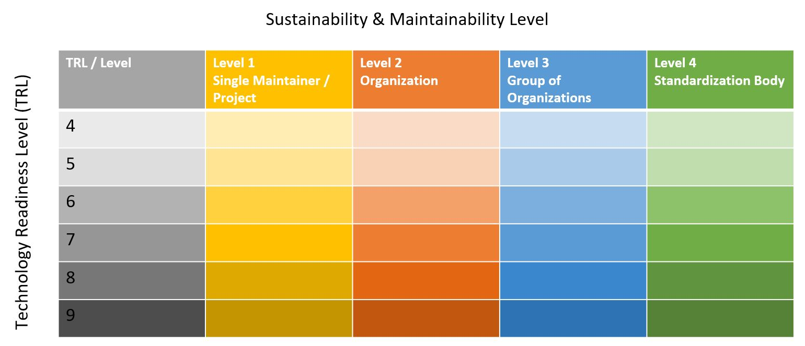

## AIOTI Ontology Landscape Portfolio

Choosing the right ontologies is an important basis for successfully implementing semantic systems and achieving semantic interoperability between the systems. To make the choice of ontologies easier, the Semantic Interoperability Expert Group of the Alliance for Internet of Things Innovation (AIOTI) Working Group on Standardization has created an Ontology Landscape that currently includes 30 ontologies from different application areas of IoT. 

Browse our [**Catalogue here**](./catalogue.html). The latest document version of the ontology landscape can be found [here](https://aioti.eu/aioti-ontology-landscape-report/) or directly as [pdf](https://aioti.eu/wp-content/uploads/2022/02/AIOTI-Ontology-Landscape-Report-R1-Published-1.0.1.pdf).
To contribute your own ontology to the next version of the Ontology Landscape, please fill out the our [**Survey**](https://ec.europa.eu/eusurvey/runner/OntologyLandscapeTemplate).

The Ontology Landscape visualization shown above is structured according to the different IoT application domains. Generic IoT ontologies that do not target a specific application domain are shown in the vertical box below.

The colour coding is explained in the table below. The colour identifies the maintainer of the ontology. Ontologies that have a single maintainer or come from a research project have a yellow colour. Ontologies that have an organization like a company, research laboratory or university that provides continuous support, not limited to a single project, are coloured in orange. Ontologies that have a group of organizations like an industry association supporting them are shown in blue. Finally, ontologies maintained by a formal standardization organization are coloured in green.

The colour intensity shows the maturity of the ontology based on the Technology Readiness Level as it is also used in European Projects. For the Ontology Landscape, only ontologies that have at least a TRL of 4 are considered:
* TRL 4 – technology validated in lab
* TRL 5 – technology validated in relevant environment (industrially relevant environment in the case of key enabling technologies)
* TRL 6 – technology demonstrated in relevant environment (industrially relevant environment in the case of key enabling technologies)
* TRL 7 – system prototype demonstration in operational environment
* TRL 8 – system complete and qualified
* TRL 9 – actual system proven in operational environment (competitive manufacturing in the case of key enabling technologies; or in space)
 
This overview gives a first indication, which ontologies could be suitable candidates in a given use case. In the following, a summary of key information about each ontology is given, including technical specification, Universal Reference Identifier (URI) of ontology file, license, maintainer and a short description. The information has been collected from the maintainers of the respective ontology who filled out a survey. A link to the full survey information is also provided for each ontology. The Semantic Interoperability Expert Group plans to collect information about more IoT ontologies and provide an updated Ontology Landscape in the future.
